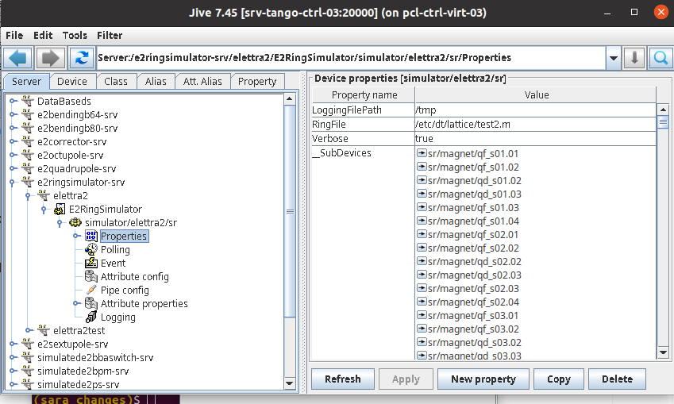

# Lattice Configuration in the Digital Twin

## 1. Copy the Lattice File

Copy the lattice file (`*.m`) into:

```bash
/etc/dt/lattice/
```

Example:

```bash
sudo cp test2.m /etc/dt/lattice/
```

The lattice file should follow the same structure, style and naming as:

```text
phase1_lattice.m
```

You may use any filename for the lattice.

---

## 2. Configure the RingFile Property

Open Jive:

```bash
jive
```

Navigate to:

```text
Servers/e2ringsimulator-srv/elettra2/E2RingSimulator/simulator/elettra2/sr
```

Inside the `Properties` tab, modify:

```text
RingFile
```

to point to the desired lattice file.

Example:

```text
/etc/dt/lattice/test2.m
```

Example Jive configuration:



---

## 3. Reload the Digital Twin

After changing the lattice file:

- restart the DT server,
- or reload the DT using the corresponding DT procedure.

This is required for the new lattice to be loaded correctly.

---

## 4. Verify Correct Loading

After restart/reload:

- verify that DT devices are correctly created,
- check that lattice-dependent properties are accessible,
- compare DT and AT outputs if needed.

---

## Notes

If the lattice file path is incorrect or the lattice cannot be loaded correctly, DT devices may fail to initialize properly.
